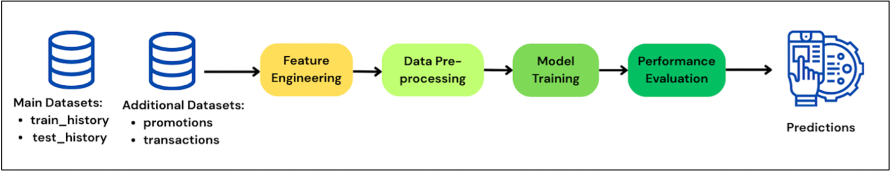
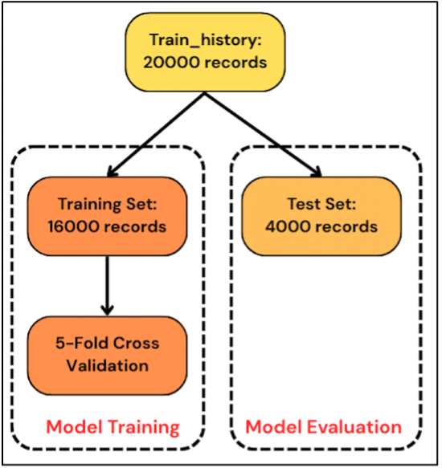
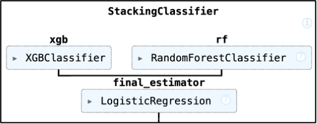

# Customer Propensity Model for Promption Response

Based on last year’s transaction records, what is the probability that a customer will respond to a given promotion?


This project presents the end-to-end process for building a predictive model to identify customers likely to respond to specific promotions. Using customer profiles, promotion details, and 20M+ historical transaction data, the model predicts a binary target variable, *“active”*, indicating promotion response. The workflow includes feature engineering, data pre-processing, model training, and performance evaluation, with implementation details outlined in the following sections.



## Part 1: Feature Engineering

To enrich the training and prediction datasets, relevant information from the promotion and transaction tables was merged.

### 1. Promotion Table

The promotion table includes details such as product category, manufacturer, dollar value, and brand. The `promotion_quantity` column was dropped due to no variance (all values = 1). The remaining attributes were extracted and integrated into both datasets to enhance the feature space.

### 2. Transaction Table

The transaction table contains over 20 million customer purchase records from 2012–2013, including store ID, region, product details, date, and spending.

#### RFM Features

RFM metrics—Recency (days since last purchase), Frequency (avg. purchases per day), and Monetary (total spend)—were computed per customer. For customers with no purchase history:

- Recency was set to 365 (max),
- Frequency and Monetary were set to 0.

These RFM metrics are derived from the transaction records and serve as strong indicators of customer engagement and loyalty. By quantifying how recently, how often, and how much a customer has spent, these features help the model differentiate between highly engaged customers and those less likely to respond to promotions. 

#### Market Group and Brand Features

*Market group* represents a higher-level product category, while *brand* refers to the specific product brand purchased by the customer. To capture customer preferences, the number of transactions per market group and brand was calculated for each customer. Missing values were filled with 0 to indicate no purchase history in that category or brand.

#### Estimated Product Price

To estimate original product prices:

- Transactions with negative values (returns) were removed. 
- Unit price was calculated (dollar amount ÷ quantity).
- Products were uniquely identified using store, category, manufacturer, and brand.
- Average unit prices over time were computed and assigned as the estimated original price per promotion.

#### Other Features

Weekday was extracted from the promotion date to capture temporal patterns.

Binary features were created for frequently occurring values to reduce dimensionality:

- **Store:** A binary `store_625933` feature was created due to its high frequency.
- **Category, Brand, Manufacturer:** IDs 2760698, 51006740 (categories), 1386413202, 324788825 (brands), and 1957688344, 122801592 (manufacturers) were each encoded as binary features.
- **Region:** Only the top six regions were retained; all others were grouped into "other."

## Part 2: Data Preprocessing

Multi-level categorical variables, such as *region* and *promotion weekday*, were encoded using dummy variables. Numerical features were scaled to a 0–1 range using Min-Max normalization.

The feature `avg_amt_per_qty` (average amount per quantity) was derived to estimate original product prices. For products with no purchase history, missing values were imputed using the **Iterative Imputer**, which predicts missing entries through multivariate regression, leveraging relationships among features for greater accuracy than mean or median imputation.

The final model input consists of *26 engineered and pre-processed features.*

| **Feature**             | **Description**                                              |
| :---------------------- | :----------------------------------------------------------- |
| region                  | One-hot encoded: Top 6 most frequent regions, with all others grouped as "other". |
| promoval                | Promotion  dollar value; normalized.                         |
| recency                 | Days since the customer’s most recent purchase; normalized.  |
| frequency               | Average number of purchases per day by the customer; normalized. |
| monetary                | Total dollar amount spent by the customer (2012–2013); normalized. |
| market_group_count      | Number of transactions per market group per customer; normalized. |
| brand_count             | Number of transactions per brand per customer; normalized.   |
| avg_amt_per_qty         | Average dollar amount per quantity  of product; normalized.  |
| promo_weekday           | One-hot encoded: Weekday of the promotion (Monday to Sunday). |
| store_625933            | Binary flag: 1 if store ID is 625933, 0 otherwise.           |
| category_42760698       | Binary flag: 1 if category ID is 42760698, 0 otherwise.      |
| category_51006740       | Binary flag: 1 if category ID is 51006740, 0 otherwise.      |
| brand_1386413202        | Binary flag: 1 if brand ID is 1386413202, 0 otherwise.       |
| brand_324788825         | Binary flag: 1 if brand ID is 324788825, 0 otherwise.        |
| manufacturer_1957688344 | Binary flag: 1 if manufacturer ID is 1957688344, 0 otherwise. |
| manufactcurer_122801592 | Binary flag: 1 if manufacturer ID is 122801592, 0 otherwise. |

## Part 3: Model Training

### Experiment Setup



Following pre-processing, the 20,000 records were split into an 80:20 training-test split, yielding 16,000 training and 4,000 evaluation records. 

### Model Selection

**Tree-based classifiers—including XGBoost, LightGBM, and Random Forest**—were experimented due to their strength in handling high-dimensional, non-linear data. These models are robust to skewed feature distributions and insensitive to scaling, and they can capture complex variable interactions without explicit feature engineering. However, due to the significant class imbalance (with inactive responses outnumbering active ones 4:1), individual classifiers showed unstable performance. To address this, the `class_weight='balanced` parameter was applied to emphasize the minority class. To further improve performnce, a **stacking ensemble combined Random Forest and XGBoost predictions using a logistic regression meta-classifier**, leveraging the strengths of both models.



### Hyperparameter Fine-Tuning

Key hyperparameters such as the number of trees (`n_estimators`) and the learning rate were carefully tuned to balance model complexity and generalization for both the Random Forest and XGBoost classifiers, thereby enhancing predictive performance. Given the dataset’s scale, `n_estimators` was set to 1000 to allow for sufficient model capacity, while the learning rate was set to 0.01 to enable gradual learning of complex patterns without overfitting.

```python
rf = RandomForestClassifier(
n_estimators=1000, class_weight='balanced',
max_depth=6, random_state=random_state)

xgb = XGBClassifier(
n_estimators=1000, learning_rate=0.01, class_weight='balanced',
use_label_encoder=False, random_state=random_state)
```

During model experimentation, 5-fold cross-validation was applied to the training set. Accuracy and AUC scores, averaged across folds, ranged from 0.63–0.66 and 0.67–0.70, respectively. These estimates may be slightly conservative, as only one-fifth of the data is used for validation in each fold.

## Part 4: Performance Evaluation

For final evaluation, the model was retrained on the full training set and tested on the holdout set, achieving **65% accuracy and 0.70 AUC**. The confusion matrix revealed a **false negative rate of 40%** and a **false positive rate of 34%**, explaining the moderate overall accuracy.

When accuracy was pushed above 80%, the false positive rate dropped to ~7%, but the false negative rate rose above 70%, leading the model to favour the majority (inactive) class. This underscores the need to assess model performance in the context of business goals. Instead of optimizing purely for accuracy, it’s crucial to balance false positives and false negatives based on their real-world impact—whether it's minimizing missed opportunities or avoiding unnecessary outreach.

## Part 5: Potential Enhancement

There are several potential ways to improve model performance in future work. First, incorporating more customer-specific features could enhance predictive power, as the current dataset contains limited individual-level information. Second, leveraging the existing RFM metrics, customers could be clustered into distinct segments based on purchasing behaviour, and separate models could be developed for each segment. This segmentation approach may better capture behavioural differences compared to a single global model. Third, it's important to move beyond accuracy as the sole evaluation metric. Given the trade-off between false positives and false negatives, alternative metrics should be used to reflect business priorities—whether the goal is to minimize missed opportunities (false negatives) or reduce unnecessary outreach (false positives).
